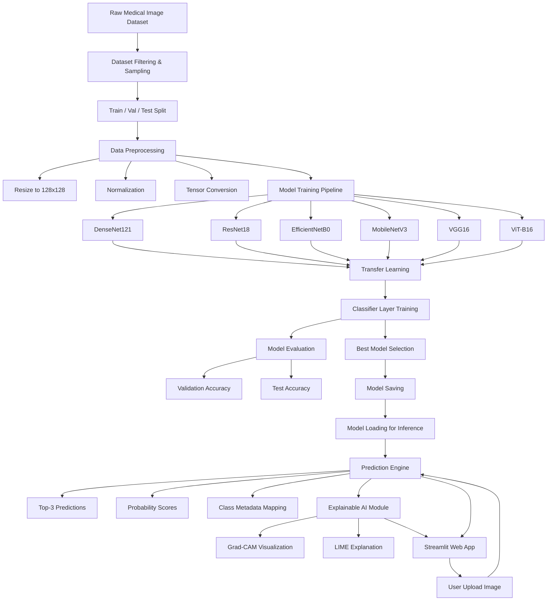

**Deep Learning-Based Cancer Type Detection Framework from Medical Images** 

**Overview**

Cancer diagnosis from medical images is a critical challenge in medical science. This project aims to develop an efficient deep learning framework to identify the presence of cancer and classify cancer types within specific organs using histopathology and MRI images.

**Dataset overview:**
| Type of Cancer                     | Sub-class                                                                 | Source          | Count   |
|----------------------------------|---------------------------------------------------------------------------|-----------------|---------|
| Acute Lymphoblastic Leukemia     | Benign, Early, Pre, Pro                                                  | Histopathology  | 20,000  |
| Brain                            | Glioma, Meningioma, Pituitary Tumor                                      | MRI             | 15,000  |
| Breast                           | Benign, Malignant                                                        | Histopathology  | 10,000  |
| Cervix                           | Dyskeratotic, Koilocytotic, Metaplastic, Parabasal, Superficial-Intermediate | Histopathology  | 25,000  |
| Kidney                           | Normal, Tumor                                                            | MRI             | 10,000  |
| Lung and Colon                   | Colon Adenocarcinoma, Colon Benign Tissue, Lung Adenocarcinoma, Lung Benign Tissue, Lung Squamous Cell Carcinoma | Histopathology  | 25,000  |
| Lymphoma                         | CLL, Follicular, Mantle Cell                                             | Histopathology  | 15,000  |
| Oral                             | Normal, Oral Squamous Cell Carcinoma                                     | Histopathology  | 10,000  |

Dataset Kaggle link: https://www.kaggle.com/datasets/obulisainaren/multi-cancer/data

G-drive links: 

Full dataset: https://drive.google.com/drive/folders/1muEW2zqc7b_ROzyeav5jVP5JZzXUozMN?usp=drive_link (please download this data and replace the path SOURCE_DIR of any code

Split dataset (train vs validation vs test): https://drive.google.com/drive/folders/1JLyk5h_NwPjg58On-5Gkv2pZV09Q8y-0?usp=drive_link (please download this folder to get the split by each organ)


To run any of these modedl, please take data from G-drive folders or from kaggle link and change the path. 


**Full Architecture**




- Images are **sampled and split** into training, validation, and test sets  
- Preprocessing includes **resizing, normalization, and tensor conversion**  
- Multiple deep learning models were evaluated:
  - DenseNet121 (final selected)
  - ResNet18
  - EfficientNetB0
  - MobileNetV3
  - VGG16
  - Vision Transformer (ViT-B16)

- Models use **transfer learning with frozen backbones**  
- Best model is **saved and reused for inference**:

  Saved Models are placed here: https://drive.google.com/drive/folders/1wPvzz0aw4uo8rCYffSBlcKzXNKbjFTV1?usp=drive_link

  Inside the above folder, there's another folder where we placed inputs for statistical tests: https://drive.google.com/drive/folders/14LeSHRLuMWc9i_X9f08wNtZ224nree6Q?usp=drive_link
    
- Predictions include:
  - Top-3 classes  
  - Probabilities  
  - Medical descriptions  

- Explainability is added using:
  - **Grad-CAM** (region importance)
  - **LIME** (local feature importance)

- Final system is deployed using a **Streamlit web app**: App link: https://cancer-app-g4evappcrrqdfhsyc7mgphj.streamlit.app/


**Folder Structure**


```text
cancer-app/
│
├── app.py   # streamlt app code
├── README.md  # readme file
├── requirements.txt # required libreries for streamlit app
├── packages.txt # required pacakes for streamlit app
├── runtime.txt
├── .gitignore
├── statistical_test.ipynb  # done statistical tests to compare multiple models
│
├── model_codes/
│   ├── DenseNet121/
│   │   ├── Acute_Lymphoblastic_Leukemia.ipynb  # model for Acute Lymphoblastic Leukemia
│   │   ├── All_Images.ipynb  # model with all images
│   │   ├── Brain.ipynb  # model for brain images
│   │   ├── Breast.ipynb  # model for beast images
│   │   ├── Cervix.ipynb # model for cervix images
│   │   ├── Colon.ipynb  # model for colon images
│   │   ├── Kidney.ipynb # model for kideny images
│   │   ├── Lung.ipynb # model for lung images
│   │   ├── Lymph.ipynb # model of lymph images
│   │   └── Oral.ipynb  # model for oral images
│   │
│   ├── EfficientNetB0/
│   │   ├── Brain.ipynb # model for brain images
│   │   ├── Kidney.ipynb # model for kideny images
│   │   └── Lymph.ipynb # model of lymph images
│   │
│   ├── MobileNetV2/
│   │   └── All_Images.ipynb # model with all images
│   │
│   ├── MobileNetV3/
│   │   ├── All_Images.ipynb
│   │   ├── Brain.ipynb # model for brain images
│   │   └── Kidney.ipynb # model for kideny images
│   │
│   ├── ResNet18/
│   │   ├── All_Images.ipynb # model with all images
│   │   ├── Brain.ipynb # model for brain images
│   │   ├── Kidney.ipynb # model for kideny images
│   │   └── Lymph.ipynb # model of lymph images
│   │
│   ├── VGG16/
│   │   └── All_Images.ipynb # model with all images
│   │
│   └── ViT_B16/
│       ├── All_Images.ipynb
│       ├── Brain.ipynb # model for brain images
│       ├── Kidney.ipynb # model for kideny images
│       └── Lymph.ipynb # model of lymph images
```
